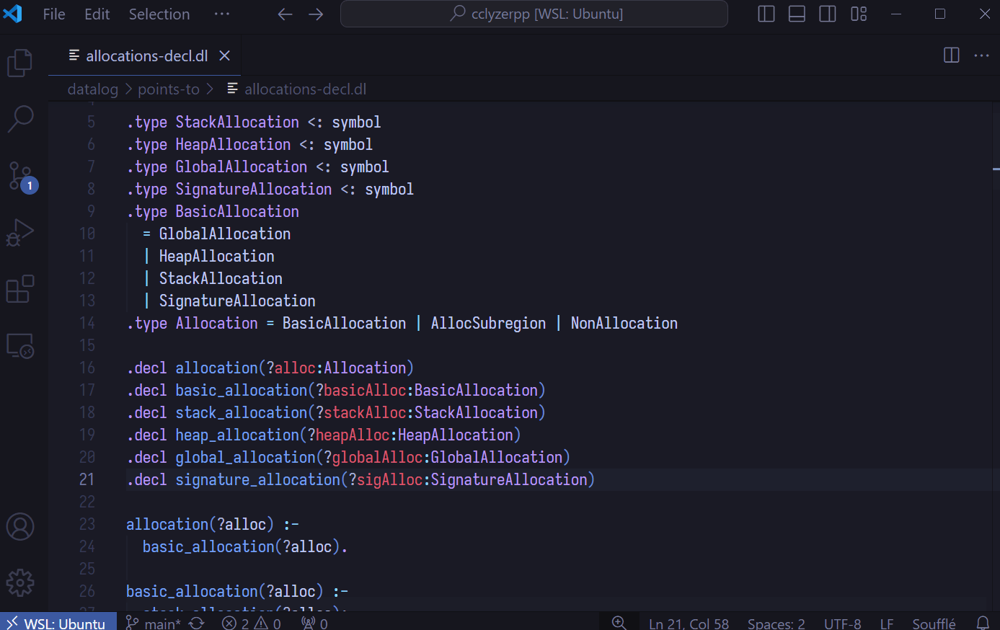

# souffle-analyzer

souffle-analyzer is a [language server](https://microsoft.github.io/language-server-protocol) for the [Souffle logic programming language](https://souffle-lang.github.io/).

The code in the demonstration GIF above is from the [cclyzer++](https://github.com/galoisinc/cclyzerpp) project.

## Try it out

See [./docs/usage.md](./docs/usage.md).

## Features

The following language server capabilities are currently available at both file level and workspace level:

- Go to defintion
  - for relations and types
- Go to type defintion
  - for constant or variable attributes within relation references or facts
- Go to references
  - for relations
- Basic code completion
- Hover
  - for relations and types
- Code actions
  - generate docstring template for relation declarations
- Diagnostics

New feature suggestions are always welcome -- please file issues if you have any.
