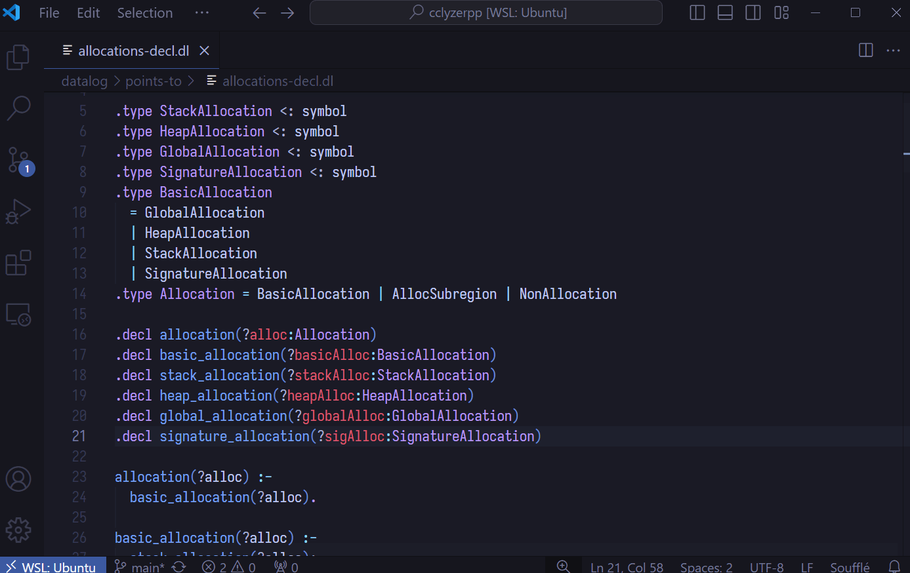

# souffle-analyzer

souffle-analyzer is a suite of tools for the [Souffle logic programming language](https://souffle-lang.github.io/), featuring a [language server](https://microsoft.github.io/language-server-protocol), a Tree-sitter parser, and a VS Code extension.

The code in the demonstration GIF above is from the [cclyzer++](https://github.com/galoisinc/cclyzerpp) project.

## Try it out

See [./docs/usage.md](./docs/usage.md).

## Features

The following language server capabilities are currently available at both file level and workspace level:

- Go to defintion
  - for relations and types
- Go to type defintion
  - for constant or variable attributes within relation references or facts
- Go to references
  - for relations
- Basic code completion
- Hover
  - for relations and types
- Code actions
  - generate docstring template for relation declarations
- Diagnostics

## Repository Structure

This project has 3 main components:

- [`src/`](./src/) and [`tests/`](./tests/):
  The language server implementation written in Python.

- [`tree-sitter-souffle/`](./tree-sitter-souffle/):
  The Tree-sitter grammar and parser for the Souffle language.

- [`vscode/`](./vscode/):
  The VS Code client extension that integrates the language server into the editor.
